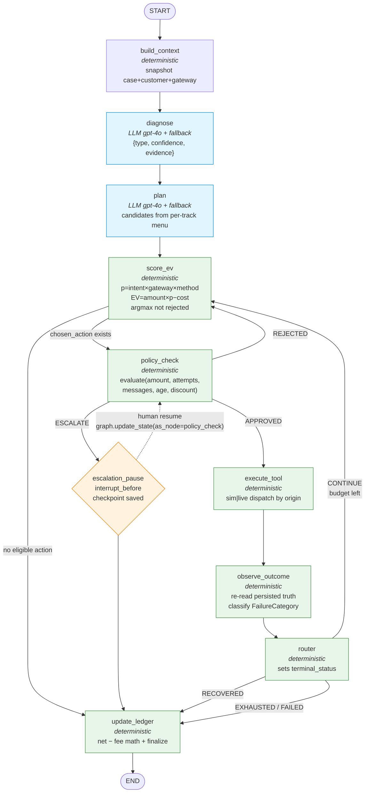
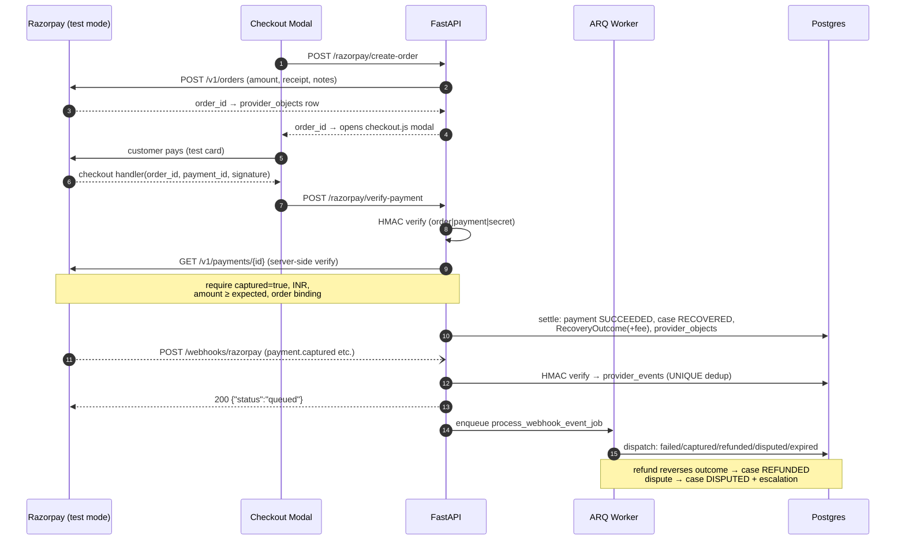
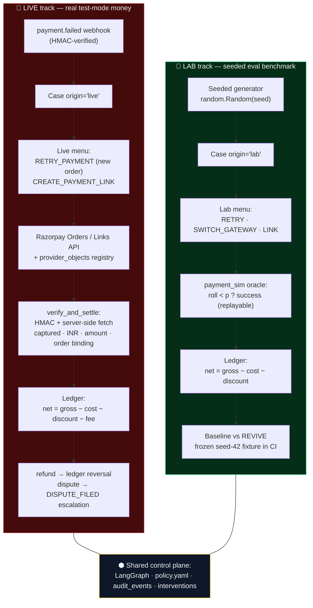
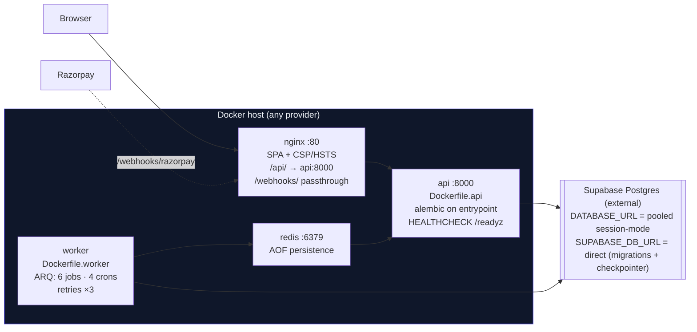

<div align="center">

# 💸 REVIVE — Revenue Rescue Engine

**An autonomous, auditable AI operator that hunts down money you're about to lose — and gets it back.**

Failed card charges. Abandoned carts. Overdue invoices. REVIVE watches for each one, figures out *why* the money stalled, picks the *cheapest* action most likely to recover it, executes inside hard guardrails — and proves the money actually moved before writing it to the books.

[](https://github.com/Ankan-07/Revenue-Recovery-Agent/actions/workflows/ci.yml)


</div>

---

## 🎯 Why REVIVE exists

Every business leaks revenue through three silent holes:

| 💳 Failed Payment | 🛒 Abandoned Checkout | 📄 Overdue Invoice |
|---|---|---|
| Card declined, UPI timeout, gateway degraded — the customer *wanted* to pay | High-intent cart left mid-funnel — no follow-up, no sale | Net-30 turned into net-90 — promise-to-pay broken quietly |

Most teams respond with dumb, blanket retries. REVIVE responds like a skilled recovery operator:

> **North-star metric:** `Net Recovered = Gross − Intervention Cost − Discount − Gateway Fee` — *not* raw recovery rate. A retry that costs ₹5 to recover ₹10,000 beats a "free" retry that recovers nothing.

## ⚡ How it works — in one diagram

Every case walks the same LangGraph state machine. The LLM gets exactly two jobs — **diagnose** and **propose** — and everything money-adjacent is deterministic:



Three structural loops (policy-rejected → next best action · retryable failure → re-score · human escalation → resume), and each one **shrinks the candidate pool** — so termination is a property of the graph, not a hope.

## 🏗️ System at a glance

```mermaid
flowchart TB
    User["👤 Revenue / Ops User<br/>(Browser)"]
    Finance["👤 Finance Operator<br/>(Escalation Queue)"]
    LLM["☁️ OpenAI API<br/>gpt-4o / gpt-4o-mini"]
    RZP["☁️ Razorpay<br/>(Test Mode Only)"]
    RZPWH["☁️ Razorpay Webhooks<br/>(HMAC-signed events)"]

    subgraph REVIVE["⬢ REVIVE — Revenue Rescue Engine"]
        FE["React Dashboard<br/>(Vite + Tailwind + Recharts)"]
        API["FastAPI Backend<br/>(API-key + session auth)"]
        Agent["LangGraph Agent<br/>State Machine"]
        DB["Supabase Postgres<br/>(SQLite fallback for dev/tests)"]
        CP["Checkpoint Store<br/>PostgresSaver / SqliteSaver"]
        Redis["Redis + ARQ<br/>(async jobs & cron)"]
        Sim["Seeded Simulator<br/>(Deterministic Oracle — LAB only)"]
    end

    User -->|"HTTPS"| FE
    Finance -->|"Approve / Reject"| FE
    FE -->|"REST JSON + httpOnly session cookie"| API
    RZPWH -->|"HMAC-SHA256 verified<br/>POST /webhooks/razorpay"| API
    API --> Agent
    Agent -->|"Structured Output"| LLM
    Agent --> DB
    Agent --> CP
    API --> DB
    API -->|"enqueue 202 jobs"| Redis
    Redis -->|"run_agent, webhook processing,<br/>cron scans, reconcile"| API
    Sim --> DB
    API -->|"create orders / links<br/>fetch payments (verify)"| RZP

    style REVIVE fill:#0f172a,stroke:#1e293b,color:#f1f5f9
    style FE fill:#1e293b,stroke:#4f46e5,color:#f1f5f9
    style API fill:#1e293b,stroke:#34d399,color:#f1f5f9
    style Agent fill:#1e293b,stroke:#fbbf24,color:#f1f5f9
    style Redis fill:#1e293b,stroke:#fb7185
```



*(Stored source: [`docs/diagrams/system-context.md`](docs/diagrams/system-context.md))*

The browser talks to FastAPI over an httpOnly session cookie. FastAPI drives a LangGraph state machine whose durable checkpoints (Postgres) let a case pause for hours — waiting for a human or a payment webhook — and resume *exactly* where it left off, even across a redeploy.

## 💰 The money path — verified twice before the ledger moves

This is the part most "payment AI" demos fake. REVIVE doesn't:



*(Stored source: [`docs/diagrams/money-path.md`](docs/diagrams/money-path.md))*

```
Frontend callback ──► HMAC signature check ──► NECESSARY but NOT SUFFICIENT
Server re-fetch   ──► GET /v1/payments/{id}  ──► captured? INR? amount? order binding?
                                     │
                          only then  ▼
              payment SUCCEEDED → case RECOVERED → ledger books net (fee included)
```

Refunds **reverse** the ledger. Disputes open a `DISPUTE_FILED` escalation. Every webhook is HMAC-verified against the raw body, deduplicated by a UNIQUE event ID, and processed asynchronously.

## 🔀 Dual-track: a real money path *and* an honest benchmark



*(Stored source: [`docs/diagrams/dual-track.md`](docs/diagrams/dual-track.md))*

- **🔴 LIVE** — real Razorpay test-mode integration: orders, payment links, webhooks, server-side settlement, fee-aware ledger.
- **🔵 LAB** — the seeded deterministic simulator, kept deliberately as a quarantined eval benchmark. Baseline vs REVIVE on identical data, frozen seed-42 fixture asserted in CI.
- An `origin` column on every case/customer/payment keeps the tracks from ever blending in a metric. No live module can even *import* the simulator.

## 🛡️ Safety principles (the non-negotiables)

1. **LLM proposes; deterministic code disposes.** The model never sets limits, writes SQL, or declares success. `policy.yaml` + the tool executor own those gates.
2. **Every financial action passes `PLAN → POLICY_CHECK → EXECUTE`.** There is no shortcut edge in the graph.
3. **Never claim recovery without verification.** Lab: re-read the persisted intervention row. Live: re-verify against the gateway itself.
4. **Idempotency is a DB constraint, not a check.** `case:action:attempt` UNIQUE keys and UNIQUE webhook event IDs; concurrent duplicates lose the race safely.
5. **Fail loudly in prod.** `APP_ENV=prod` requires Postgres, Redis, Razorpay test keys, comms credentials — and refuses to boot otherwise. Live keys (`rzp_live_`) are fatal in *every* environment.
6. **Every transition is an audit event.** Finance can reconstruct any case from the audit trail alone.

<details>
<summary><b>📜 The full policy gate (policy.yaml)</b></summary>

```yaml
payment:
  max_retries: 3            # Razorpay dunning cadence (T+1, T+2, T+3)
  retry_window_hours: 72    # Razorpay 3-day late-authorization window
  min_amount: 1             # Razorpay minimum (₹1)
messaging:
  max_messages_per_case: 3
  minimum_hours_between_messages: 24
discount:
  max_percent: 10
  max_absolute_amount: 1000
human_approval:
  required_above_amount: 100000   # ₹1L → mandatory human escalation
max_attempts: 6                   # hard graph-loop cap
```

The LLM never sees these numbers. It cannot edit them. It cannot route around them.

</details>

## ✨ Feature highlights

- 🤖 **Autonomous LangGraph agent** — 10-node state machine with LLM diagnosis/planning, deterministic EV scoring (`amount × p − cost`), and structural termination.
- 🔐 **Real money path, zero real risk** — Razorpay test-mode orders + payment links + checkout modal, with server-side capture verification and actual gateway fees booked into the ledger.
- 🪝 **Webhook-first architecture** — HMAC-verified, race-safe dedup, fast-ack + async processing, full refund/dispute/expiry handling.
- 👥 **Human-in-the-loop** — cases over ₹1L pause at a durable checkpoint and wait in an escalation queue; approval resumes the exact graph state.
- 🧾 **Finance-grade ledger** — `net = gross − cost − discount − gateway_fee`, partial-recovery outcomes, refund reversal, dispute flagging.
- 🔑 **Per-person API keys** — PBKDF2-hashed, scoped (`operator`/`internal`/`admin`), exchanged once for an httpOnly session cookie; rate limits and daily quotas on money-touching routes.
- ⚙️ **Async worker** — Redis + ARQ: 202-acknowledged agent runs, webhook processing, cron scans, retries with backoff, dead-letter visibility in a durable `jobs` table.
- 📊 **Operator dashboard** — React + Recharts: metrics, funnel, case timelines, audit trail, live escalation queue, embedded Razorpay checkout.
- 🔭 **LangSmith tracing** — every node, tool, and service emits a span; degrades silently without a key.

## 🧰 Tech stack

| Layer | Choice | Why |
|---|---|---|
| Agent | **LangGraph** + durable checkpointers | Auditable edges, `interrupt`/resume for HIL |
| Backend | **FastAPI** + SQLAlchemy 2 + Alembic | Typed contracts end-to-end, SQLite↔Postgres swappable |
| LLM | **OpenAI** gpt-4o / gpt-4o-mini | Native structured outputs with heuristic fallback |
| Database | **Supabase Postgres** (direct + pooled URLs) | Managed backups/PITR; SQLite for hermetic dev/tests |
| Payments | **Razorpay SDK** (test-mode enforced) | Real orders/links/webhooks; `rzp_test_` guard refuses live keys |
| Async | **Redis + ARQ** | Durable job rows, retries, cron, dead-letters |
| Auth | **PBKDF2 API keys + HMAC sessions** | Per-person identity, instant revocation |
| Frontend | **React 19 + Vite + Tailwind + TanStack Query + Recharts** | Dashboard-first, polling, typed API client |
| Tracing | **LangSmith** | Trace tree per agent run |
| Deploy | **Docker Compose** (api + worker + nginx + redis) | Host-agnostic: Render / Railway / Fly / VPS |



*(Stored source: [`docs/diagrams/deployment.md`](docs/diagrams/deployment.md))*

## 🚀 Quickstart

### Prerequisites
- Python 3.11+ and [`uv`](https://docs.astral.sh/uv/)
- Node.js 20+ and `npm`
- (optional) Docker for the full stack

### 1. Configure environment
```bash
cp .env.example .env
# fill in: OPENAI_API_KEY, RAZORPAY_KEY_ID/SECRET/WEBHOOK_SECRET (rzp_test_...),
#          LANGSMITH_API_KEY (optional), SESSION_SECRET_KEY
```

### 2. Backend
```bash
cd backend
uv sync                       # install dependencies
uv run alembic upgrade head   # run migrations (SQLite by default)
uv run pytest -q              # 27 test files, fully hermetic — no network, no keys needed
uv run uvicorn app.main:app --reload --port 8000
```

### 3. Frontend
```bash
cd frontend
npm install
npm run dev                   # → http://localhost:5173
```

### 4. Seed the world & run the agent
```bash
# Log into the dashboard with an operator API key (bootstrap one via BOOTSTRAP_API_KEY
# or create one through /admin/keys), then:
#   Dashboard → "Run Revenue Rescue"  → seeds a deterministic world and detects cases
#   Case Detail → "Run Agent"          → watch DETECTED → … → RECOVERED live
```

### 5. Real (test-mode) payments
Open a `FAILED_PAYMENT` case and click **Pay now (test card)**:

```bash
# root .env (backend only — never expose the SECRET)
RAZORPAY_KEY_ID=rzp_test_...
RAZORPAY_KEY_SECRET=...
RAZORPAY_WEBHOOK_SECRET=...

# frontend/.env (KEY_ID only — it is public by design)
VITE_RAZORPAY_KEY_ID=rzp_test_...
```

1. `POST /razorpay/create-order` creates a **real** Razorpay order for the failed payment.
2. The checkout.js modal opens; pay with the success test card `4111 1111 1111 1111` (any future expiry/CVV) — see [Razorpay's test cards](https://razorpay.com/docs/payments/payment-gateway/web-integration/standard/test-card-details/) for failure paths.
3. `POST /razorpay/verify-payment` verifies the HMAC signature, **re-fetches the payment server-side**, and only on full verification settles the case and writes the net ledger.
4. Point a Razorpay dashboard webhook at `<your-host>/webhooks/razorpay` to exercise the full event pipeline (capture, refund, dispute).

<details>
<summary><b>🐳 Docker (full stack)</b></summary>

```bash
cp .env.example .env && vi .env   # set DATABASE_URL + SUPABASE_DB_URL + secrets
docker compose up --build
```

| Service | URL / notes |
|---|---|
| nginx (SPA + `/api` proxy + `/webhooks` passthrough) | `http://localhost:80` |
| FastAPI | `http://localhost:8000` (HEALTHCHECK → `/readyz`) |
| ARQ worker | cron: reconcile 03:00 UTC, hourly promise/abandon/invoice scans |
| Redis | AOF persistence; use `rediss://` + TLS in prod |

Full env-var reference: [`docs/deploy.md`](docs/deploy.md) · ops procedures: [`docs/runbook.md`](docs/runbook.md)
</details>

## 📁 Project structure

```
revenue-rescue-engine/
├── backend/app/
│   ├── agent/          # LangGraph graph, 9 nodes, contracts, prompts, runner
│   ├── api/            # 10 routers: cases, escalations, webhooks, checkout, auth, …
│   ├── services/       # case, event, razorpay, provider_event/object, api_key, …
│   ├── tools/          # sim tools (oracle-backed) + tools/live/ (Razorpay-backed)
│   ├── policies/       # policy.yaml + pure evaluate() engine
│   ├── jobs/           # ARQ worker + client
│   ├── models/         # 20 SQLAlchemy entities
│   └── simulation/     # LAB: seeded generator + deterministic oracle + baseline
├── backend/tests/      # 27 hermetic test files
├── frontend/src/       # React dashboard (pages, api clients, Razorpay checkout)
├── docs/
│   ├── diagrams/       # ← the diagrams used in this README (source: hld.md / lld.md)
│   ├── deploy.md · runbook.md · observability.md
├── nginx/nginx.conf    # SPA + security headers + /api proxy + webhook passthrough
├── hld.md              # High-Level Design  (C4 diagrams, principles, trade-offs)
├── lld.md              # Low-Level Design   (schemas, APIs, graph wiring, coupling)
└── PRODUCTION_PLAN.md  # phased production roadmap (Phases 0/A/B ✅ · C–F next)
```

## ✅ Testing & CI

```bash
cd backend && uv run pytest -q
```

CI (`.github/workflows/ci.yml`) runs on every push/PR:
- **Lint & types** — `ruff` (incl. the `utcnow()` ban) + `mypy`
- **Tests** — full suite against a real **Postgres 16 service container** + the frozen seed-42 eval fixture
- **Security** — Gitleaks secret scan, `VITE_*` secret audit, Dockerfile live-key scan, config-hardening tests

The suite is fully hermetic: LLM nodes fall back to deterministic heuristics and all Razorpay SDK calls sit behind monkeypatchable seams — no API keys, no network.

## 🗺️ Roadmap

- [x] **Phase 0–B** — Supabase, API keys, containers, ARQ worker, config guards, webhook receiver, live Razorpay actions, server-verified settlement with gateway fees
- [ ] **Phase C** — real messaging (Resend email + Twilio SMS), delivery tracking, DLT/TRAI compliance, quiet hours, PII masking at trace boundaries
- [ ] **Phase D** — live detection for abandoned checkouts & overdue invoices from provider signals
- [ ] **Phase E** — nightly reconciliation with the provider-object registry, escalation SLA alerts, backup/DR drills
- [ ] **Phase F** — chaos tests (duplicate/out-of-order webhooks, concurrent resolves), full runbook, cutover flags

See [`PRODUCTION_PLAN.md`](PRODUCTION_PLAN.md) for the complete phase breakdown.

## 📚 Documentation

| Doc | What's inside |
|---|---|
| [`hld.md`](hld.md) | System context, container diagrams, principles, state machine, trade-offs |
| [`lld.md`](lld.md) | ER model, graph wiring, API contracts, webhook matrix, auth internals, coupling analysis |
| [`prd.md`](prd.md) | Product behavior spec (§-referenced throughout the code) |
| [`PRODUCTION_PLAN.md`](PRODUCTION_PLAN.md) | Locked decisions + phase-by-phase production roadmap |
| [`docs/diagrams/`](docs/diagrams/) | Standalone Mermaid diagrams (this README's visuals) |
| [`docs/deploy.md`](docs/deploy.md) · [`docs/runbook.md`](docs/runbook.md) | Deploy reference & ops procedures |

## 🤝 Contributing

PRs welcome! The litmus test before merging anything:

> *"Could the LLM being wrong here cause money to move incorrectly?"* — If yes, that decision must be deterministic.

Keep new money paths behind the `policy_check` gate, idempotent by DB constraint, and audited.

## 📄 License

No license file yet — all rights reserved by the repository owner. (Drop in a `LICENSE` — MIT or Apache-2.0 are typical picks — and update this section.)
